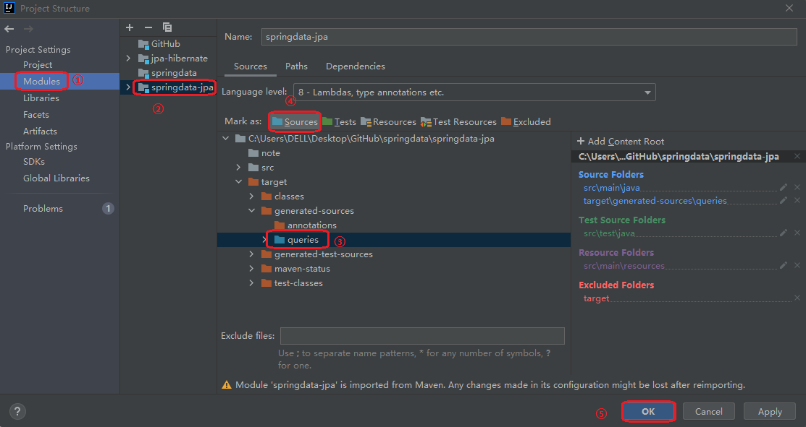

Spring Data Repository抽象的目标是显著减少为了各种持久化存储实现数据访问层所需的样板代码量。  
Spring Data JPA官方文档：(https://docs.spring.io/spring-data/jpa/docs/current/reference/html/#jpa.query-methods.named-queries)
### CrudRepository接口源码
CrudRepository<T, ID>接口继承于Repository<T, ID>，其中T代表对象实体类型，ID代表id的类型
```java
@NoRepositoryBean
public interface CrudRepository<T, ID> extends Repository<T, ID> {
    /*用于插入或修改。有主键为修改，无主键为插入
     * 获得插入后记录的自增id*/
    <S extends T> S save(S entity);
    /*通过集合保存多个实体*/
    <S extends T> Iterable<S> saveAll(Iterable<S> entities);
    Optional<T> findById(ID id);
    boolean existsById(ID id);
    /*查询所有，返回实体类集合*/
    Iterable<T> findAll();
    /*通过集合的主键查询多个实体，返回集合*/
    Iterable<T> findAllById(Iterable<ID> ids);
    /*查询记录总数量*/
    long count();
    void deleteById(ID id);
    void delete(T entity);
    /*通过id集合删除多个记录*/
    void deleteAllById(Iterable<? extends ID> ids);
    /*通过实体集合删除多个记录*/
    void deleteAll(Iterable<? extends T> entities);
    /*删除所有*/
    void deleteAll();
}
```

### PagingAndSortingRepository<T, ID>接口源码分析
继承于CrudRepository<T, ID>，主要用于实现分页和排序
```java
@NoRepositoryBean
public interface PagingAndSortingRepository<T, ID> extends CrudRepository<T, ID> {
    /*查询所有并排序，返回排序后的集合*/
    Iterable<T> findAll(Sort sort);
    /*查询所有并分页显示，返回分页*/
    Page<T> findAll(Pageable pageable);
}
```
#### 分页部分接口源码及测试实例
Page<T>类的源码如下：
```java
public interface Page<T> extends Slice<T> {
    static <T> Page<T> empty() {
        return empty(Pageable.unpaged());
    }

    static <T> Page<T> empty(Pageable pageable) {
        return new PageImpl(Collections.emptyList(), pageable, 0L);
    }
    /*获取总页数*/
    int getTotalPages();
    /*获取元素总数*/
    long getTotalElements();

    <U> Page<U> map(Function<? super T, ? extends U> converter);
}
```
Page<T> 继承于 Slice<T>，下面是Slice<T>接口的源码：
```java
public interface Slice<T> extends Streamable<T> {
    int getNumber();
    int getSize();
    int getNumberOfElements();
    List<T> getContent();
    boolean hasContent();
    Sort getSort();
    boolean isFirst();
    boolean isLast();
    boolean hasNext();
    boolean hasPrevious();
    default Pageable getPageable() {
        return PageRequest.of(this.getNumber(), this.getSize(), this.getSort());
    }
    Pageable nextPageable();
    Pageable previousPageable();
    <U> Slice<U> map(Function<? super T, ? extends U> converter);
    default Pageable nextOrLastPageable() {
        return this.hasNext() ? this.nextPageable() : this.getPageable();
    }
    default Pageable previousOrFirstPageable() {
        return this.hasPrevious() ? this.previousPageable() : this.getPageable();
    }
}
```
下面对PagingAndSortingRepository<T, ID>接口进行测试，创建SpringDataJpaPagingAndSortTest测试类。  
首先，在CustomerRespository接口添加继承PagingAndSortingRepository<T, ID>
```java
public interface CustomerRespository extends PagingAndSortingRepository<Customer, Long>, CrudRepository<Customer, Long> {
    /*CrudRepository<T, V>泛型中，T为实体类的类型，V为Id的类型*/
}
```
#### 分页+排序测试案例
```java
@ContextConfiguration(classes = SpringDataJPAConfig.class)  // 这种是使用Config配置类形式
@RunWith(SpringJUnit4ClassRunner.class)
public class SpringDataJpaPagingAndSortTest {
    @Autowired
    CustomerRespository customerRespository;
    /*分页测试案例*/
    @Test
    public void testPaging(){
        Page<Customer> page = customerRespository.findAll(PageRequest.of(0, 2));
        System.out.println(page.getTotalPages());
        System.out.println(page.getTotalElements());
        System.out.println(page.getContent());
    }
    /*排序测试实现*/
    /*硬编码的方式，如果属性名修改，则这里参数也要进行修改，不安全，不推荐*/
    @Test
    public void testSort(){
        Sort sort = Sort.by("custId").descending();
        Iterable<Customer> all = customerRespository.findAll(sort);
        System.out.println(all);
    }

    /*软编码的方式，安全，推荐使用这种方式*/
    @Test
    public void testSortTypeSafe(){
        Sort.TypedSort<Customer> sortType = Sort.sort(Customer.class);
        Sort sort = sortType.by(Customer::getCustId).descending();
        /*多个排序规则，可在后面添加and()*/
        //Sort sort = sortType.by(Customer::getCustId).descending().and(sortType.by(Customer::getCustName));
        Iterable<Customer> all = customerRespository.findAll(sort);
        System.out.println(all);
    }
    /*排序+分页测试实现*/
    @Test
    public void testPagingAndSort(){
        /*先设置排序规则*/
        Sort.TypedSort<Customer> sortType = Sort.sort(Customer.class);
        Sort sort = sortType.by(Customer::getCustId).descending();
        /*在设置分页*/
        Page<Customer> page = customerRespository.findAll(PageRequest.of(0, 2, sort));
        System.out.println(page.getContent());
    }
}
```

### 自定义操作JPQL和SQL
前面都是使用`Spring Data JPA`提供的`Repository`接口提供的方法实现简单的CURD和分业及排序等持久化操作，
对于复杂的持久化操作就需要自定义持久化操作来实现。  
主要包括`JPQL`、规定方法名、`Query by Example`、`Specifications`、`Querydsl`
#### `JPQL`(原生`SQL`)(只能实现静态查询)
- `@Query()`
    - 查询如果返回单个实体，就用pojo接收，如果返回多个实体，就需要用集合接收。
    - 参数的设置方式：①索引方式 ?数字 指定参数顺序② :参数名  然后结合@Param注解指定参数名字
    - 对于增删改的操作，必须要加上事务的支持：添加```@Transactional```和```@Modifying```注解，通常放在业务逻辑层声明
    - JPQL实际上是不支持新增的，只不过我们是基于hibernate实现的JPA的一种伪新增的模式.尽管如此，依旧不能仅用INSERT实现新增操作，而是要以INSERT+SELECT的方式来实现  

在`CustomerRespository`接口中声明JPQL持久化操作方法，修改`CustomerRespository`接口如下：
```java
package com.ever.repositories;

import com.ever.pojo.Customer;
import org.springframework.data.domain.PageRequest;
import org.springframework.data.jpa.repository.Modifying;
import org.springframework.data.jpa.repository.Query;
import org.springframework.data.repository.CrudRepository;
import org.springframework.data.repository.PagingAndSortingRepository;
import org.springframework.data.repository.query.Param;
import org.springframework.transaction.annotation.Transactional;

import java.util.List;

public interface CustomerRespository extends PagingAndSortingRepository<Customer, Long>, CrudRepository<Customer, Long> {
    /*CrudRepository<T, V>泛型中，T为实体类的类型，V为Id的类型*/

    /*Spring Data JPA 的自定义持久化操作*/
    /****************************************JPQL方式**********************************************/
    // 查询
    //@Query("SELECT cus FROM Customer cus WHERE cus.custName=?1")
//    @Query("FROM Customer WHERE custName=?1") // 参数的索引方式
//    List<Customer> findCustomerByCustName(String custName);
    /*参数传递的注解方式*/
    @Query("FROM Customer WHERE custName=:custName")
    List<Customer> findCustomerByCustName(@Param("custName") String custName);

    // 添加
    /*JPQL实际上是不支持新增的，只不过我们是基于hibernate实现的JPA的一种伪新增的模式
    * 尽管如此，依旧不能仅用INSERT实现新增操作，而是要以INSERT+SELECT的方式来实现*/
    @Transactional
    @Modifying      // 通知SpringDataJPA是增删改的操作
    @Query("INSERT INTO Customer(custName, custAddress) SELECT c.custName,c.custAddress FROM Customer c WHERE c.custId=:id ")
    int insertCustomerBySelect(@Param("id") Long id);

    // 更新修改,对于更新操作要以事务进行
    @Transactional
    @Modifying      // 通知SpringDataJPA是增删改的操作
    @Query("UPDATE Customer c SET c.custName=:custName where c.custId=:id")
    int updateCustomerById(@Param("custName") String custName, @Param("id") Long id);

    // 删除
    @Transactional
    @Modifying      // 通知SpringDataJPA是增删改的操作
    @Query("delete from Customer c where c.custId=:id")
    int deleteCustomerById(@Param("id") Long id);

    /*原生SQL语句实现查询*/
    /*注意！！！采用原生SQL语句查询，使用字段及表名均为数据库中的表名及字段名*/
    @Query(value = "SELECT * FROM cst_customer c WHERE cust_name=:custName",
    nativeQuery = true)
    List<Customer> findCustomerByCustNameBySQL(@Param("custName") String custName);
}
```
创建测试类`JPQLTest`，对`JPQL`持久化方式进行测试：
```java
package com.ever;

import com.ever.config.SpringDataJPAConfig;
import com.ever.pojo.Customer;
import com.ever.repositories.CustomerRespository;
import org.junit.Test;
import org.junit.runner.RunWith;
import org.springframework.beans.factory.annotation.Autowired;
import org.springframework.data.domain.Page;
import org.springframework.data.domain.PageRequest;
import org.springframework.test.context.ContextConfiguration;
import org.springframework.test.context.junit4.SpringJUnit4ClassRunner;
import java.util.List;

@ContextConfiguration(classes = SpringDataJPAConfig.class)  // 这种是使用Config配置类形式
@RunWith(SpringJUnit4ClassRunner.class)
public class JPQLTest {

    @Autowired
    CustomerRespository customerRespository;

    @Test
    public void testFind(){
        List<Customer> customer = customerRespository.findCustomerByCustName("萧炎");
        System.out.println(customer);
    }

    @Test
    public void testUpdate(){
        int result = customerRespository.updateCustomerById("肖战", 1L);
        System.out.println(result);
    }

    @Test
    public void testDelete(){
        int result = customerRespository.deleteCustomerById(9L);
        System.out.println(result);
    }

    @Test
    public void testInsert(){
        int result = customerRespository.insertCustomerBySelect(6L);
        System.out.println(result);
    }

    /*原生SQL语句查询*/
    @Test
    public void testFindBySQL(){
        List<Customer> result = customerRespository.findCustomerByCustNameBySQL("李星云");
        System.out.println(result);
    }
}
```
#### 规定方法名(只能实现静态查询)
- 支持的查询方法**主题关键字（前缀）**  
    - 决定当前方法的作用
    - 只支持查询和删除操作

| 关键字      | 描述 |  
| :----------- | :----------- |
| `find…By, , , , ,read…Byget…Byquery…Bysearch…Bystream…By` | 通常返回存储库类型、子类型或结果包装器（如 ）或任何其他特定于存储的结果包装器的常规查询方法。可用作 ，或与其他关键字结合使用。`CollectionStreamablePageGeoResultsfindBy…findMyDomainTypeBy…` |
| `exists…By `| 存在投影，通常返回结果。`boolean` |
| `count…By` | 返回数值结果的计数投影。 |
| `delete…By,remove…By` | 删除查询方法返回无结果 （） 或删除计数。`void` |
| `…First<number>…,…Top<number>…` | 将查询结果限制为结果的第一个。此关键字可以出现在主题（以及其他关键字）和 之间的任何位置。`<number>findby` |
| `…Distinct…` | 使用不同的查询仅返回唯一结果。请参阅商店特定的文档，了解该功能是否受支持。此关键字可以出现在主题（以及其他关键字）和 之间的任何位置。`findby` |

- JPA 支持的关键字以及包含该关键字的方法的转换内容

| 关键词 | 样本 | JPQL代码段 |
| :--- | :--- | :--- |
| `Distinct` | `findDistinctByLastnameAndFirstname` | `select distinct … where x.lastname = ?1 and x.firstname = ?2` |
| `And` | `findByLastnameAndFirstname` | `… where x.lastname = ?1 and x.firstname = ?2` |
| `Or` | `findByLastnameOrFirstname` | `… where x.lastname = ?1 or x.firstname = ?2` |
| `Is`,`Equals` | `findByFirstname`,`findByFirstnameIs`,`findByFirstnameEquals` | `… where x.firstname = ?1` |
| `Between` | `findByStartDateBetween` | `… where x.startDate between ?1 and ?2` |
| `LessThan` | `findByAgeLessThan` | `… where x.age < ?1` |
| `LessThanEqual` | `findByAgeLessThanEqual` | `… where x.age <= ?1` |
| `GreaterThan` | `findByAgeGreaterThan` | `… where x.age > ?1` |
| `GreaterThanEqual` | `findByAgeGreaterThanEqual` | `… where x.age >= ?1` |
| `After` | `findByStartDateAfter` | `… where x.startDate > ?1` |
| `Before` | `findByStartDateBefore` | `… where x.startDate < ?1` |
| `IsNull`,`Null` | `findByAge(Is)Null` | `… where x.age is null` |
| `IsNotNull`,`NotNull` | `IsNotNull`,`NotNull` | `… where x.age not null` |
| `Like` | `findByFirstnameLike` | `… where x.firstname like ?1` |
| `NotLike` | `findByFirstnameNotLike` | `… where x.firstname not like ?1` |
| `StartingWith` | `findByFirstnameStartingWith` | `… where x.firstname like ?1`（附加参数绑定%) |
| `EndingWith` | `findByFirstnameEndingWith` | `… where x.firstname like ?1`（参数以前缀绑定%) |
| `Containing` | `findByFirstnameContaining` | `… where x.firstname like ?1`（参数绑定包装在%) |
| `OrderBy` | `findByAgeOrderByLastnameDesc` | `… where x.age = ?1 order by x.lastname desc` |
| `Not` | `findByLastnameNot` | `… where x.lastname <> ?1` |
| `In` | `findByAgeIn(Collection<Age> ages)` | `… where x.age in ?1` |
| `NotIn` | `findByAgeNotIn(Collection<Age> ages)` | `… where x.age not in ?1` |
| `True` | `findByActiveTrue()` | `… where x.active = true` |
| `False` | `findByActiveFalse()` | `… where x.active = false` |
| `IgnoreCase` | `IgnoreCase` | `… where UPPER(x.firstname) = UPPER(?1)` |

- 支持的查询方法谓词关键字和修饰符

| 逻辑关键字      | 关键字表达式 |  
| :----------- | :----------- |
| `AND` | `And` |
| `OR` | `Or` |
| `AFTER` | `After,IsAfter` |
| `BEFORE` | `Before,IsBefore` |
| `CONTAINING` | `Containing,IsContainingContains` |
| `BETWEEN` | `Between,IsBetween` |
| `ENDING_WITH` | `EndingWith`,`IsEndingWithEndsWith` |
| `EXISTS` | `Exists` |
| `FALSE` | `False`,`IsFalse` |
| `GREATER_THAN` | `GreaterThan`,`IsGreaterThan` |
| `GREATER_THAN_EQUALS` | `GreaterThanEqual`,`IsGreaterThanEqual` |
| `IN` | `In`,`IsIn` |
| `IS` | `Is`,（或无关键字）`Equals` |
| `IS_EMPTY` | `IsEmpty`,`Empty` |
| `IS_NOT_EMPTY` | `IsNotEmpty`,`NotEmpty` |
| `IsNotEmpty`,`NotEmpty` | `NotNull`,`IsNotNull` |
| `IS_NULL` | `Null`,`IsNull` |
| `LESS_THAN` | `LessThan`,`IsLessThan` |
| `LESS_THAN_EQUAL` | `LESS_THAN_EQUAL` |
| `LIKE` | `Like`,`IsLike` |
| `NEAR` | `Near`,`IsNear` |
| `NOT` | `Not`,`IsNot` |
| `NOT_IN` | `NotIn`,`IsNotIn` |
| `NotIn`,`IsNotIn` | `NotIn`,`IsNotIn` |
| `REGEX` | `Regex`, ,`MatchesRegexMatches` |
| `STARTING_WITH` | `StartingWith`, ,`IsStartingWithStartsWith` |
| `TRUE` | `TRUE` |
| `WITHIN` | `Within`,`IsWithin` |

- 另外还支持的修饰符

| 关键词 | 描述 |
| :--- | :--- |
| `IgnoreCase,IgnoringCase` | 与谓词关键字一起使用，用于不区分大小写的比较。 |
| `AllIgnoreCase,AllIgnoringCase` | 忽略所有合适属性的大小写。在查询方法谓词中的某个位置使用。 |
| `OrderBy…` | 指定静态排序顺序，后跟属性路径和方向（例如 ）。`OrderByFirstnameAscLastnameDesc` |

在`com.ever.repositories`仓库下创建`CustomerMethodNameRepository`接口，声明规定方法名类型的方法实现持久化操作：
```java
import com.ever.pojo.Customer;
import org.springframework.data.jpa.repository.Modifying;
import org.springframework.data.repository.CrudRepository;
import org.springframework.data.repository.PagingAndSortingRepository;
import org.springframework.transaction.annotation.Transactional;

import java.util.List;

public interface CustomerMethodNameRepository extends PagingAndSortingRepository<Customer, Long>, CrudRepository<Customer, Long> {

    List<Customer> findByCustName(String custName);

    boolean existsByCustName(String custName);

    @Transactional
    @Modifying
    int deleteByCustId(Long custId);

    List<Customer> findByCustNameLike(String custName);
}
```
创建测试类`MethodNameTest`进行简单的测试：
```java
package com.ever;

import com.ever.config.SpringDataJPAConfig;
import com.ever.pojo.Customer;
import com.ever.repositories.CustomerMethodNameRepository;
import com.ever.repositories.CustomerRespository;
import org.junit.Test;
import org.junit.runner.RunWith;
import org.springframework.beans.factory.annotation.Autowired;
import org.springframework.test.context.ContextConfiguration;
import org.springframework.test.context.junit4.SpringJUnit4ClassRunner;

import java.util.List;

@ContextConfiguration(classes = SpringDataJPAConfig.class)  // 这种是使用Config配置类形式
@RunWith(SpringJUnit4ClassRunner.class)
public class MethodNameTest {
    @Autowired
    CustomerMethodNameRepository customerMethodNameRepository;

    @Test
    public void testFindByCustName(){
        List<Customer> customer = customerMethodNameRepository.findByCustName("肖战");
        System.out.println(customer);
    }

    @Test
    public void testExistsByCustName(){
        System.out.println(customerMethodNameRepository.existsByCustName("萧炎"));
    }

    @Test
    public void testDeleteByCustId(){
        System.out.println(customerMethodNameRepository.deleteByCustId(11L));
    }

    /*注意需要我们自己采用%实现模糊查询*/
    @Test
    public void testFindByCustomerLike(){
        List<Customer> result = customerMethodNameRepository.findByCustNameLike("唐%");
        System.out.println(result);
    }
}
```
#### Query By Example(可以实现动态查询)
只能实现一些简单的查询操作。  
- 只支持查询
    - **不支持嵌套或分组查询的属性约束**，如`firstname = ? 0 or (firstname = ? 1 and lastname = ? 2)`
    - **只支持字符串** `start/contains/ends/regex`(正则表达式)匹配和其他属性类型的精确匹配。

实现：
将Repository继承QueryByExampleExecutor
```java
package com.ever.repositories;

import com.ever.pojo.Customer;
import org.springframework.data.repository.PagingAndSortingRepository;
import org.springframework.data.repository.query.QueryByExampleExecutor;

public interface CustomerQueryByExampleRepository extends PagingAndSortingRepository<Customer, Long>, QueryByExampleExecutor<Customer> {

}
```
测试：
```java
package com.ever;

import com.ever.config.SpringDataJPAConfig;
import com.ever.pojo.Customer;
import com.ever.repositories.CustomerQueryByExampleRepository;
import org.junit.Test;
import org.junit.runner.RunWith;
import org.springframework.beans.factory.annotation.Autowired;
import org.springframework.data.domain.Example;
import org.springframework.data.domain.ExampleMatcher;
import org.springframework.test.context.ContextConfiguration;
import org.springframework.test.context.junit4.SpringJUnit4ClassRunner;

@ContextConfiguration(classes = SpringDataJPAConfig.class)  // 这种是使用Config配置类形式
@RunWith(SpringJUnit4ClassRunner.class)
public class QueryByExampleTest {
    @Autowired
    CustomerQueryByExampleRepository queryByExampleRepository;

    /*简单实例：客户名称 客户地址 动态查询*/
    @Test
    public void testFind(){
        // 查询条件
        Customer customer = new Customer();
        customer.setCustName("唐三");
        customer.setCustAddress("不良人");

        /*设置匹配器*/
        ExampleMatcher matcher = ExampleMatcher.matching()
                .withIgnorePaths("custName")    // 设置忽略的属性
                .withIgnoreCase("custAdderss")  // 设置忽略大小写
                .withStringMatcher(ExampleMatcher.StringMatcher.ENDING) // 对所有条件字符串进行了结尾匹配
                .withMatcher("custAddress", m -> m.endsWith().ignoreCase())     // 针对单个条件进行限制，会使withIgnoreCase()方法失效，需要单独设置ignoreCase()
                .withMatcher("custAddress", ExampleMatcher.GenericPropertyMatchers.endsWith().ignoreCase());

        // 通过Example构建查询条件
        /*注意！！1这里使用org.springframework.data.domain.Example*/
        Example<Customer> example = Example.of(customer, matcher);

        Iterable<Customer> result = queryByExampleRepository.findAll(example);
        System.out.println(result);
    }

}
```
#### QueryDSL(支持动态查询)
QueryDSL是基于ORM框架或者SQL平台上的一个通用查询框架。  
QueryDSL扩展能让我们以链式方式代码编写查询方式，该扩展需要一个接口QuerydslPredicateExecutor，他定义了很多查询方法。  
QuerydslPredicateExecutor接口源码：
```java
public interface QuerydslPredicateExecutor<T> {
    Optional<T> findOne(Predicate predicate);

    Iterable<T> findAll(Predicate predicate);

    Iterable<T> findAll(Predicate predicate, Sort sort);

    Iterable<T> findAll(Predicate predicate, OrderSpecifier<?>... orders);

    Iterable<T> findAll(OrderSpecifier<?>... orders);

    Page<T> findAll(Predicate predicate, Pageable pageable);

    long count(Predicate predicate);

    boolean exists(Predicate predicate);

    <S extends T, R> R findBy(Predicate predicate, Function<FetchableFluentQuery<S>, R> queryFunction);
}
```
在pom.xml文件中添加querysql依赖和插件  
先在<properties>中添加版本号约束
```xml
    <properties>
        <maven.compiler.source>8</maven.compiler.source>
        <maven.compiler.target>8</maven.compiler.target>
        <querysql.version>5.0.0</querysql.version>
        <apt.version>1.1.3</apt.version>
    </properties>
```
添加依赖：
```xml
<!-- https://mvnrepository.com/artifact/com.querydsl/querydsl-jpa -->
<dependency>
    <groupId>com.querydsl</groupId>
    <artifactId>querydsl-jpa</artifactId>
    <version>5.0.0</version>
</dependency>
```
添加插件：
```xml
    <build>
        <plugins>
            <!--该插件可以生成querysdl需要的查询对象，执行mvn compile即可-->
            <plugin>
                <groupId>com.mysema.maven</groupId>
                <artifactId>apt-maven-plugin</artifactId>
                <version>${apt.version}</version>
                <dependencies>
                    <dependency>
                        <groupId>com.querydsl</groupId>
                        <artifactId>querydsl-apt</artifactId>
                        <version>${querysql.version}</version>
                    </dependency>
                </dependencies>
                <executions>
                    <execution>
                        <phase>generate-sources</phase>
                        <goals>
                            <goal>process</goal>
                        </goals>
                        <configuration>
                            <outputDirectory>target/generated-sources/queries</outputDirectory>
                            <processor>com.querydsl.apt.jpa.JPAAnnotationProcessor</processor>
                            <logOnlyOnError>true</logOnlyOnError>
                        </configuration>
                    </execution>
                </executions>
            </plugin>
        </plugins>
    </build>
```
然后在Maven中，点击springdata-jpa-->Lifecycle-->compile编译，会在target/generated-sources文件下生成queries文件夹，
并在queries文件夹下生成com.ever/pojo.QCustomer.java，也即Customer类的Q类。针对这个Q类，就可以对某一个属性去设置条件了。  
为了能够**调用Q类**，我们需要通过**设置项目结构**将`queries`文件夹设置成代码文件夹：点击File-->Project Structure，进行如下设置：


创建CustomerQueryDSLRepository接口：
```java
package com.ever.repositories;

import com.ever.pojo.Customer;
import org.springframework.data.querydsl.QuerydslPredicateExecutor;
import org.springframework.data.repository.PagingAndSortingRepository;

public interface CustomerQueryDSLRepository extends PagingAndSortingRepository<Customer, Long>,
        QuerydslPredicateExecutor<Customer> {

}
```
创建测试类QueryDSLTest：
```java
package com.ever;

import com.ever.config.SpringDataJPAConfig;
import com.ever.pojo.QCustomer;
import com.ever.repositories.CustomerQueryDSLRepository;
import com.querydsl.core.types.dsl.BooleanExpression;
import org.junit.Test;
import org.junit.runner.RunWith;
import org.springframework.beans.factory.annotation.Autowired;
import org.springframework.test.context.ContextConfiguration;
import org.springframework.test.context.junit4.SpringJUnit4ClassRunner;

@ContextConfiguration(classes = SpringDataJPAConfig.class)  // 这种是使用Config配置类形式
@RunWith(SpringJUnit4ClassRunner.class)
public class QueryDSLTest {
    @Autowired
    CustomerQueryDSLRepository queryDSLRepository;

    @Test
    public void testFind(){
        QCustomer customer = QCustomer.customer;

        // 通过Id精确查找
        // 设置条件
        BooleanExpression eq = customer.custId.eq(1L);
        // 进行查询
        System.out.println(queryDSLRepository.findOne(eq));
    }

    /*查询客户名称范围(in)
    * id > ?
    * 地址 精确*/
    @Test
    public void testFindRange(){
        QCustomer customer = QCustomer.customer;

        // 设置条件
        BooleanExpression eq = customer.custName.in("唐三", "李星云", "肖战")
                .and(customer.custId.gt(4L))    // gt()为大于
                .and(customer.custAddress.eq("不良人"));
        // 进行查询
        System.out.println(queryDSLRepository.findOne(eq));
    }

    /*常用比较函数：
    * 等于        EQ      equal                  .eq()
    * 不等于       NE      not equal              .ne()
    * 小于        LT      less than               .lt()
    * 大于        GT      greater than            .gt()
    * 小于等于     LE      less than or equal      .loe()
    * 大于等于     GE      greater than or equal   .goe()
    */
  
  
    /*动态查询*/
    @Test
    public void testSearchDynamic() {
      /*通过前端传入的参数*/
      Customer params = new Customer();
      params.setCustId(1L);
      params.setCustName("李星云，姬如雪");
      params.setCustAddress("不良人");

      QCustomer customer = QCustomer.customer;

      // 初始条件，设置为永远成立的条件
      BooleanExpression expression = customer.isNotNull().or(customer.isNotNull());

      expression = params.getCustId() > -1 ?
              expression.and(customer.custId.gt(params.getCustId())):expression;
      expression = !StringUtils.isEmpty(params.getCustName()) ?
              expression.and(customer.custName.in(params.getCustName().split("，"))) : expression;
      expression = !StringUtils.isEmpty(params.getCustAddress()) ?
              expression.and(customer.custAddress.eq(params.getCustAddress())) : expression;

      System.out.println(queryDSLRepository.findAll(expression));
    }
    
  /*自定义列查询、分组
   * 需要使用原生态的方式
   * */
  // @Autowired // 使用Autowired装配会有线程安全的问题
  // 要保证线程安全问题，需要使用注解@PersistenceContext注解，通过对每个Bean绑定一个EntityManager实现线程安全
  @PersistenceContext // 线程安全的装配方式
  EntityManager entityManager;

  @Test
  public void testDefinition() {
    JPAQueryFactory jpaQueryFactory = new JPAQueryFactory(entityManager);

    QCustomer customer = QCustomer.customer;

    /*构建基于QueryDSL的查询*/
    /*自定义类Tuple帮助接收返回值类型，因为只查询两列，没有与之匹配的类型，所以帮我们自定义类型接收*/
    JPAQuery<Tuple> jpaQuery = jpaQueryFactory.select(customer.custName, customer.custAddress)
            .from(customer)
            .where(customer.custAddress.eq("不良人"))
            .orderBy(customer.custId.desc());

    /*执行查询*/
    List<Tuple> fetch = jpaQuery.fetch();

    for (Tuple member : fetch){
      System.out.print(member.get(customer.custName) + ":");
      System.out.println(member.get(customer.custAddress));
    }
  }
}
```
#### Specifications(支持动态查询)
CustomerSpecificationsRepository接口需要继承JpaSpecificationExecutor<T>接口。  
限制：不能分组、聚合函数、需要自己通过entityManager来实现  
JpaSpecificationExecutor<T>接口源码：
```java
public interface JpaSpecificationExecutor<T> {
    Optional<T> findOne(@Nullable Specification<T> spec);

    List<T> findAll(@Nullable Specification<T> spec);

    Page<T> findAll(@Nullable Specification<T> spec, Pageable pageable);

    List<T> findAll(@Nullable Specification<T> spec, Sort sort);

    long count(@Nullable Specification<T> spec);

    boolean exists(Specification<T> spec);
}
```
创建CustomerSpecificationsRepository接口:
```java
package com.ever.repositories;

import com.ever.pojo.Customer;
import org.springframework.data.jpa.repository.JpaSpecificationExecutor;
import org.springframework.data.repository.PagingAndSortingRepository;

public interface CustomerSpecificationsRepository extends PagingAndSortingRepository<Customer, Long>,
        JpaSpecificationExecutor<Customer> {

}
```
创建测试类SpecificationsTest：
```java
package com.ever;

import com.alibaba.druid.util.StringUtils;
import com.ever.config.SpringDataJPAConfig;
import com.ever.pojo.Customer;
import com.ever.repositories.CustomerSpecificationsRepository;
import org.junit.Test;
import org.junit.runner.RunWith;
import org.springframework.beans.factory.annotation.Autowired;
import org.springframework.data.jpa.domain.Specification;
import org.springframework.test.context.ContextConfiguration;
import org.springframework.test.context.junit4.SpringJUnit4ClassRunner;

import javax.persistence.criteria.*;
import java.util.ArrayList;
import java.util.List;

@ContextConfiguration(classes = SpringDataJPAConfig.class)  // 这种是使用Config配置类形式
@RunWith(SpringJUnit4ClassRunner.class)
public class SpecificationsTest {
    @Autowired
    CustomerSpecificationsRepository customerSpecificationsRepository;

    /*客户范围查询（in）
    * id > ?
    * 地址 精确*/
    @Test
    public void testFind(){
        List<Customer> customers = customerSpecificationsRepository.findAll(new Specification<Customer>() {
            @Override
            public Predicate toPredicate(Root<Customer> root, CriteriaQuery<?> query, CriteriaBuilder criteriaBuilder) {
                /*root:理解为from Customer，可以用于获取列
                * query:组合（order by, where 等）
                * CriteriaBuilder criteriaBuilder：设置各种条件，如where语句中的(>  <  in ...)*/

                // 通过root获取需要的列，注意获取到的类型要与属性类型相同
                Path<Long> custId = root.get("custId");
                Path<String> custName = root.get("custName");
                Path<String> custAddress = root.get("custAddress");

                // 设置条件
                /*参数1：为哪一个字段设置条件  参数2：条件设置的值*/
                Predicate predicateId = criteriaBuilder.gt(custId, 5L);
                /*<T> CriteriaBuilder.In<T> in(Expression<? extends T> var1);
                * 只有一个参数*/
                CriteriaBuilder.In<String> predicateName = criteriaBuilder.in(custName);
                predicateName.value("肖战").value("李星云").value("唐三");
                Predicate predicateAddress = criteriaBuilder.equal(custAddress, "不良人");

                // 条件组合
                Predicate predicate = criteriaBuilder.and(predicateId, predicateName, predicateAddress);
                return predicate;
            }
        });
        System.out.println(customers);
    }

    /*动态查询*/
    @Test
    public void testFindDynamic(){
        /*通过前端传入的参数*/
        Customer params = new Customer();
        params.setCustId(1L);
        params.setCustName("李星云，姬如雪");
        //params.setCustAddress("不良人");

        List<Customer> customers = customerSpecificationsRepository.findAll(new Specification<Customer>() {
            @Override
            public Predicate toPredicate(Root<Customer> root, CriteriaQuery<?> query, CriteriaBuilder criteriaBuilder) {

                // 通过root获取需要的列，注意获取到的类型要与属性类型相同
                Path<Long> custId = root.get("custId");
                Path<String> custName = root.get("custName");
                Path<String> custAddress = root.get("custAddress");

                // 设置条件
                List<Predicate> predicates = new ArrayList<>();
                if(!StringUtils.isEmpty(params.getCustAddress())){
                    predicates.add(criteriaBuilder.equal(custAddress, params.getCustAddress()));
                }
                if(params.getCustId() > -1){
                    predicates.add(criteriaBuilder.gt(custId, params.getCustId()));
                }
                if(!StringUtils.isEmpty(params.getCustName())){
                    CriteriaBuilder.In<String> predicateName = criteriaBuilder.in(custName);
                    predicateName.value("肖战").value("李星云").value("唐三");
                    predicates.add(predicateName);
                }

                // 条件组合
                Predicate predicate = criteriaBuilder.and(predicates.toArray(new Predicate[predicates.size()]));

                // 还可以实现排序等
                Order desc = criteriaBuilder.desc(custId);

                //return predicate;
                return query.where(predicate).orderBy(desc).getRestriction();
            }
        });
        System.out.println(customers);
    }
}
```
